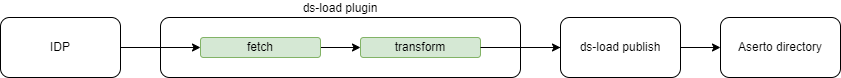

# ds-load transformation templates

The ds-load tranformation templates use the go template syntax to output two arrays one for [objects](https://buf.build/aserto-dev/directory/docs/main:aserto.directory.common.v3#aserto.directory.common.v3.Object) and one for [relations](https://buf.build/aserto-dev/directory/docs/main:aserto.directory.common.v3#aserto.directory.common.v3.Relation).

As the data gets read from the source IDP and inserted into the directory, there are 3 stages the data is processed:



1. the fetcher (`ds-load plugin fetch`) reads data and outputs a valid json representing the source data (e.g. a user)
2. the transformer (`ds-load plugin transform`) applies the transformation template over the data received from the fetcher and outputs the source objects representation as two arrays (objects and relations)
3. the publisher imports the output from the transform stage into the directory

## Auth0 use case
This would be a process of tranforming a auth0 user object to it's directory representation of objects/relations.

### Transformer input
The transformer input is actually the output of the fetch command. `ds-load transform` receives an array of json objects as input and applies the given template on each element of that array.

example of a fetcher output:
```json
[
    {
        "created_at": "2024-01-12T10:45:11.138Z",
        "email": "rick@the-citadel.com",
        "email_verified": true,
        "identities": [
            {
                "connection": "Username-Password-Authentication",
                "isSocial": false,
                "provider": "auth0",
                "user_id": "65a118371e5f3e33399d0fa8"
            }
        ],
        "name": "Rick Sanchez",
        "nickname": "rick",
        "picture": "https://www.topaz.sh/assets/templates/citadel/img/Rick%20Sanchez.jpg",
        "roles": [
            {
                "description": "admin",
                "id": "rol_r8zZczsSuq25J3tx",
                "name": "admin"
            },
            {
                "description": "evil genius",
                "id": "rol_RrcNi465Gkd69eLB",
                "name": "evil_genius"
            }
        ],
        "updated_at": "2024-01-12T11:07:06.994Z",
        "user_id": "auth0|65a118371e5f3e33399d0fa8",
        "user_metadata": {
            "superuser": true
        }
    }
]
```

### Template

The transform template uses the [go template syntax](https://pkg.go.dev/text/template) to output a valid json that contains objects and relations.

For example, if we want an object type user with the key being the users email, we would add the following item in the objects array:
```go
{
    "id": "{{ $.email }}",
    "type": "user"
}
```
Here, `{{ $.email }}` is a key at the root level of the input object (see [above](#transformer-input))
***
For an email identity object, we would do somethink like this:
```go
{
    "id": "{{ $.email }}",
    "type": "identity"
}
```
***
If we want to link these objects together using a relation, we need to add a new entry in the relations array:
```go
{
    "object_type": "identity",
    "object_id": "{{ $.email }}",
    "relation": "identifier",
    "subject_type": "user",
    "subject_id": "{{ $.email }}"

}
```
***
If we want to iterate over a list of items (eg. roles) and add an object for each one:
```go
{{ range $i, $element := $.roles }}
    {{ if $i }},{{ end }}
    {
    "id": "{{$element.name}}",
    "type": "group",
    "properties":{}
    }
{{ end }}
```
> note: we need to be careful with the commas. `{{ if $i }},{{ end }}` is handy since it will add a comma before all elements, except the first one.
***
Building on this, a basic transform template for this user would look like this:

```go
{
  "objects": [
    {
      "id": "{{ $.email }}",
      "type": "user",
      "displayName": "{{ $.nickname }}",
      "created_at":"{{ $.created_at }}",
      "properties":{
        "email": "{{ $.email }}",
        "enabled": true,
        "picture": "{{ $.picture }}"
        {{ range $key, $value := $.user_metadata }}
        ,"{{ $key }}": {{ marshal $value }}
        {{ end }}
      }
    },
    {
      "id": "{{ $.user_id }}",
      "type": "identity",
      "properties": {
        "verified": true
      }
    },
    {
        "id": "{{ $.email }}",
        "type": "identity",
        "properties": {
          "verified": {{ .email_verified }}
        }
    }
    {{ if $.roles }}, {{ end }}
    {{ range $i, $element := $.roles }}
      {{ if $i }},{{ end }}
      {
        "id": "{{$element.name}}",
        "type": "group",
        "properties":{}
      }
    {{ end }}
  ],
  "relations":[
      {
        "object_type": "identity",
        "object_id": "{{ $.user_id }}",
        "relation": "identifier",
        "subject_type": "user",
        "subject_id": "{{ $.email }}"
      },
      {
        "object_type": "identity",
        "object_id": "{{ $.email }}",
        "relation": "identifier",
        "subject_type": "user",
        "subject_id": "{{ $.email }}"
      }
    {{ if $.roles }}, {{ end }}
    {{ range $i, $element := $.roles }}
      {{ if $i }},{{ end }}
      {
        "object_type": "group",
        "object_id": "{{$element.name}}",
        "relation": "member",
        "subject_type": "user",
        "subject_id": "{{$.email}}"
      }
    {{ end }}
  ]
}
```

### Transformer ouput

The input for the transformer can vary from plugin to plugin, but the output needs to be in the same format in order to be consumed by ds-load:

```json
[
    {
        "objects": [],
        "relations": []
    }
]
```
***
The above transformation template, using the given input from [Transformer input](#transformer-input) would render the following json result.

```json
[
    {
        "objects": [
            {
                "type": "user",
                "id": "rick@the-citadel.com",
                "displayName": "rick",
                "properties": {
                    "email": "rick@the-citadel.com",
                    "enabled": true,
                    "picture": "https://www.topaz.sh/assets/templates/citadel/img/Rick%20Sanchez.jpg",
                    "superuser": true
                },
                "createdAt": "2024-01-12T10:45:11.138Z"
            },
            {
                "type": "identity",
                "id": "auth0|65a118371e5f3e33399d0fa8",
                "properties": {
                    "verified": true
                }
            },
            {
                "type": "identity",
                "id": "rick@the-citadel.com",
                "properties": {
                    "verified": true
                }
            },
            {
                "type": "group",
                "id": "admin",
                "properties": {}
            },
            {
                "type": "group",
                "id": "evil_genius",
                "properties": {}
            }
        ],
        "relations": [
            {
                "objectType": "identity",
                "objectId": "auth0|65a118371e5f3e33399d0fa8",
                "relation": "identifier",
                "subjectType": "user",
                "subjectId": "rick@the-citadel.com"
            },
            {
                "objectType": "identity",
                "objectId": "rick@the-citadel.com",
                "relation": "identifier",
                "subjectType": "user",
                "subjectId": "rick@the-citadel.com"
            },
            {
                "objectType": "group",
                "objectId": "admin",
                "relation": "member",
                "subjectType": "user",
                "subjectId": "rick@the-citadel.com"
            },
            {
                "objectType": "group",
                "objectId": "evil_genius",
                "relation": "member",
                "subjectType": "user",
                "subjectId": "rick@the-citadel.com"
            }
        ]
    }
]
```
## Fetchers that output multiple object types

A fetch operation can, in some cases, output multiple object types. 
For example, the [google plugin](/plugins/google/pkg/app/assets/transform_template.tmpl) outputs an array oj users mixed with groups. In this case, the transform template needs to know how to handle both types. 
```go
{
  "objects": [
    {{ if contains $.kind "admin#directory#user" }}
    // render user objects
    {{ end }}

    {{ if contains $.kind "admin#directory#group" }}
    // render group objects
    {{ end }}
  ],
  "relations":[  
    {{ if contains $.kind "admin#directory#user" }}
    //render user relations
    {{ end }}

    {{ if contains $.kind "admin#directory#group" }}
    // render group relations
    {{ end }}
  ]
}
```
This way, the transformer will output objects and relations for a user when receiving a kind containing `admin#directory#user` and objects and relations for a group when receiving a kind containing `admin#directory#group`
## Helper functions

Since go template does not support some operations, we provide a list of [helper functions](../sdk/transform/functions.go)
***
### last
`last i a`
return true if index `i` is the last element in `a` where `i` is an int value and `a` can be a map or an array

example:
```
{{ range $i, $element := $.roles }}
    "last": "{{ last $i $.roles }}"
{{ end }}
```
***
### contains
alias for `strings.Contains(str, substr string) bool`

example:
```
...
{{ if contains $.kind "admin" }}
...
{{ end }}
...
```
***
### marshal
does json.marshal on the received value and returns the json result. useful for escaping strings that contain special characters of saving an entire json object as a value

example:
```
"properties": {{ marshal $.Attributes }}
```
```   
{{ range $key, $value := $.Attributes }}
{{ if $i }},{{ end }}
"{{ $key }}": {{ marshal $value }}
{{ end }}
```
***
### fromEnv
`fromEnv key ENV_VAR` returns a key/value pair with the value of the given ENV_VAR

```
{{ fromEnv "userId" "USER_ID" }}
```
***
### phoneIso3166
returns the ISO3166 representation of a phone number

```
"object_id": "{{ phoneIso3166 $.profile.mobilePhone }}
```
***
### add
returns the result of the addition of 2 numbers

```
{{$index = add $index 1}}
```